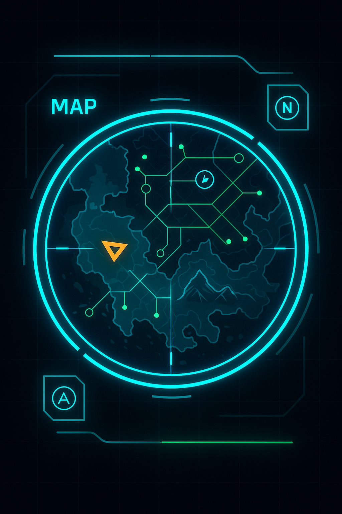
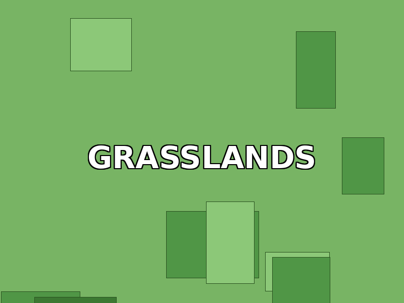

# Image to HTML File Mapping - KnightGaming Website

This document shows exactly which HTML files reference which images, making it easy to identify where images are used.

---

## ✅ Complete - Existing Images (24 files)

### Characters (4 images)

| Image File | Used In HTML Files | Product Code |
|-----------|-------------------|--------------|
| `armor_light.png` | chr-la-001.html, assets.html, shop.html | CHR-LA-001 |
| `armor_medium.png` | chr-ma-002.html, assets.html | CHR-MA-002 |
| `armor_heavy.png` | chr-ha-003.html, assets.html | CHR-HA-003 |
| `npc_civilians.png` | chr-npc-004.html, assets.html | CHR-NPC-004 |

### Environments (4 images)

| Image File | Used In HTML Files | Product Code |
|-----------|-------------------|--------------|
| `env_grassland.png` | env-gl-001.html, assets.html, shop.html, bun-start-001.html, index.html (as product1.jpg) | ENV-GL-001 |
| `env_desert.png` | env-ds-002.html, assets.html | ENV-DS-002 |
| `env_volcanic.png` | env-vc-003.html, assets.html | ENV-VC-003 |
| `env_city.png` | env-fc-004.html, assets.html | ENV-FC-004 |

### Weapons (4 images)

| Image File | Used In HTML Files | Product Code |
|-----------|-------------------|--------------|
| `weapon_melee.png` | wpn-ml-001.html, assets.html, shop.html | WPN-ML-001 |
| `weapon_ranged.png` | wpn-rn-002.html, assets.html | WPN-RN-002 |
| `weapon_futuristic.png` | wpn-fc-003.html, assets.html | WPN-FC-003 |
| `gadget_set.png` | wpn-sc-004.html, assets.html | WPN-SC-004 |

### UI/HUD (4 images)

| Image File | Used In HTML Files | Product Code |
|-----------|-------------------|--------------|
| `hud_overlay.png` | ui-hud-001.html, assets.html, shop.html | UI-HUD-001 |
| `inventory_grid.png` | ui-inv-002.html, sys-inv-001.html, assets.html | UI-INV-002, SYS-INV-001 |
| `minimap.png` | ui-map-003.html, assets.html | UI-MAP-003 |
| `button_icons.png` | ui-btn-004.html, assets.html | UI-BTN-004 |

### General/Homepage (7 images)

| Image File | Used In HTML Files | Purpose |
|-----------|-------------------|---------|
| `hero-bg.jpg` | All pages (via CSS), tut-fun-001.html | Hero background, tutorial placeholder |
| `product1.jpg` | index.html | Featured product (Grasslands) |
| `product2.jpg` | index.html | Featured product (Skill Tree) |
| `product3.jpg` | index.html | Featured product (Tutorial) |
| `blog1.jpg` | index.html, blog.html | Blog article 1 |
| `blog2.jpg` | index.html, blog.html | Blog article 2 |
| `blog3.jpg` | index.html, blog.html | Blog article 3 |

---

## ❌ Missing - Images Needed (23 files)

### System Templates (8 images needed)

| Image Needed | HTML Files Waiting | Product Code | Priority |
|-------------|-------------------|--------------|----------|
| `sys_inventory.png` | sys-inv-001.html | SYS-INV-001 | HIGH |
| `sys_quest.png` | sys-que-001.html | SYS-QUE-001 | HIGH |
| `sys_dialogue.png` | sys-dlg-001.html | SYS-DLG-001 | HIGH |
| `sys_combat.png` | sys-cmb-001.html | SYS-CMB-001 | MEDIUM |
| `sys_crafting.png` | sys-crf-001.html | SYS-CRF-001 | MEDIUM |
| `sys_saveload.png` | sys-sav-001.html | SYS-SAV-001 | MEDIUM |
| `sys_ai_behavior.png` | sys-aib-001.html | SYS-AIB-001 | LOW |
| `sys_multiplayer.png` | sys-mpf-001.html | SYS-MPF-001 | LOW |

**Note:** These pages currently use `inventory_grid.png` as placeholder or no image

### Tutorial Courses (12 images needed)

| Image Needed | HTML Files Waiting | Product Code | Priority |
|-------------|-------------------|--------------|----------|
| `tut_fundamentals.jpg` | tut-fun-001.html | TUT-FUN-001 | HIGH |
| `tut_2d_game.jpg` | tut-2dg-001.html | TUT-2DG-001 | HIGH |
| `tut_3d_game.jpg` | tut-3dg-001.html | TUT-3DG-001 | HIGH |
| `tut_character_controller.jpg` | tut-chc-001.html | TUT-CHC-001 | MEDIUM |
| `tut_enemy_ai.jpg` | tut-eai-001.html | TUT-EAI-001 | MEDIUM |
| `tut_level_design.jpg` | tut-lvl-001.html | TUT-LVL-001 | MEDIUM |
| `tut_ui_design.jpg` | tut-uxd-001.html | TUT-UXD-001 | MEDIUM |
| `tut_sound_music.jpg` | tut-snd-001.html | TUT-SND-001 | MEDIUM |
| `tut_optimization.jpg` | tut-opt-001.html | TUT-OPT-001 | LOW |
| `tut_multiplayer.jpg` | tut-mpl-001.html | TUT-MPL-001 | LOW |
| `tut_mobile.jpg` | tut-mob-001.html | TUT-MOB-001 | LOW |
| `tut_publishing.jpg` | tut-pub-001.html | TUT-PUB-001 | LOW |

**Note:** These pages currently use `hero-bg.jpg` as placeholder or no image

### Bundles (3 images needed)

| Image Needed | HTML Files Waiting | Product Code | Priority |
|-------------|-------------------|--------------|----------|
| `bundle_starter.jpg` | bun-start-001.html | BUN-START-001 | HIGH |
| `bundle_action.jpg` | bun-act-002.html | BUN-ACT-002 | HIGH |
| `bundle_mmo.jpg` | bun-mmo-003.html | BUN-MMO-003 | HIGH |

**Note:** These pages currently use `env_grassland.png` or no image as placeholder

---

## HTML Files by Category

### Category Pages (Using existing images)
- `index.html` - Homepage with hero, featured products, blog ✅
- `shop.html` - Main shop listing ✅
- `assets.html` - All asset packs ✅
- `bundles.html` - Bundle listing (needs individual bundle images)
- `templates.html` - System templates listing (needs individual system images)
- `tutorials.html` - Tutorial courses listing (needs individual tutorial images)
- `blog.html` - Blog listing ✅

### Asset Product Pages (✅ All Complete)

**Characters:**
- chr-la-001.html → armor_light.png ✅
- chr-ma-002.html → armor_medium.png ✅
- chr-ha-003.html → armor_heavy.png ✅
- chr-npc-004.html → npc_civilians.png ✅

**Environments:**
- env-gl-001.html → env_grassland.png ✅
- env-ds-002.html → env_desert.png ✅
- env-vc-003.html → env_volcanic.png ✅
- env-fc-004.html → env_city.png ✅

**Weapons:**
- wpn-ml-001.html → weapon_melee.png ✅
- wpn-rn-002.html → weapon_ranged.png ✅
- wpn-fc-003.html → weapon_futuristic.png ✅
- wpn-sc-004.html → gadget_set.png ✅

**UI/HUD:**
- ui-hud-001.html → hud_overlay.png ✅
- ui-inv-002.html → inventory_grid.png ✅
- ui-map-003.html → minimap.png ✅
- ui-btn-004.html → button_icons.png ✅

### System Template Pages (❌ 0/8 Complete)

- sys-inv-001.html → ❌ needs sys_inventory.png (currently using inventory_grid.png)
- sys-que-001.html → ❌ needs sys_quest.png
- sys-dlg-001.html → ❌ needs sys_dialogue.png
- sys-cmb-001.html → ❌ needs sys_combat.png
- sys-crf-001.html → ❌ needs sys_crafting.png
- sys-sav-001.html → ❌ needs sys_saveload.png
- sys-aib-001.html → ❌ needs sys_ai_behavior.png
- sys-mpf-001.html → ❌ needs sys_multiplayer.png

### Tutorial Course Pages (❌ 0/12 Complete)

- tut-fun-001.html → ❌ needs tut_fundamentals.jpg (currently using hero-bg.jpg)
- tut-2dg-001.html → ❌ needs tut_2d_game.jpg
- tut-3dg-001.html → ❌ needs tut_3d_game.jpg
- tut-chc-001.html → ❌ needs tut_character_controller.jpg
- tut-eai-001.html → ❌ needs tut_enemy_ai.jpg
- tut-lvl-001.html → ❌ needs tut_level_design.jpg
- tut-uxd-001.html → ❌ needs tut_ui_design.jpg
- tut-snd-001.html → ❌ needs tut_sound_music.jpg
- tut-opt-001.html → ❌ needs tut_optimization.jpg
- tut-mpl-001.html → ❌ needs tut_multiplayer.jpg
- tut-mob-001.html → ❌ needs tut_mobile.jpg
- tut-pub-001.html → ❌ needs tut_publishing.jpg

### Bundle Pages (❌ 0/3 Complete)

- bun-start-001.html → ❌ needs bundle_starter.jpg (currently using env_grassland.png)
- bun-act-002.html → ❌ needs bundle_action.jpg
- bun-mmo-003.html → ❌ needs bundle_mmo.jpg

---

## Image Update Checklist

When generating a new image, update the corresponding HTML file(s):

### For System Templates:
```html
<!-- Currently: -->


<!-- Update to: -->

```

### For Tutorials:
```html
<!-- Currently: -->


<!-- Update to: -->

```

### For Bundles:
```html
<!-- Currently: -->


<!-- Update to: -->

```

---

## Quick Stats

| Category | HTML Files | Images Exist | Images Needed | Status |
|----------|-----------|--------------|---------------|--------|
| Characters | 4 | 4 | 0 | ✅ 100% |
| Environments | 4 | 4 | 0 | ✅ 100% |
| Weapons | 4 | 4 | 0 | ✅ 100% |
| UI/HUD | 4 | 4 | 0 | ✅ 100% |
| Systems | 8 | 0 | 8 | ❌ 0% |
| Tutorials | 12 | 0 | 12 | ❌ 0% |
| Bundles | 3 | 0 | 3 | ❌ 0% |
| General | 7 | 7 | 0 | ✅ 100% |
| **TOTAL** | **46** | **23** | **23** | **50%** |

---

*Last Updated: October 27, 2025*
